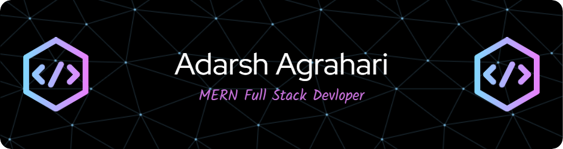

<h1 align="center">Hi 👋, I'm Adarsh Agrahari</h1>
<h3 align="center">A passionate MERN Stack Developer from India.</h3>

  

---

  

  

---

### 🚀 About Me:
- 🌱 I’m currently learning **MERN Stack Development**
- 👨‍💻 My projects: [Portfolio Website](https://abderaj17.github.io/Portfolio-Website/)
- 💬 Ask me about **React, MERN**
- 📫 Reach me at: **agrahariadarsh68@gmail.com**
- ⚡ Fun fact: **Let's have a game of BGMI 😃**

---

### 🔗 Connect with Me:

  
  
  
  
  
  

---

### 🛠 Languages & Tools:

  
  
  
  
  
  
  
  
  
  
  

---

### 📊 GitHub Stats:

  

  

  

